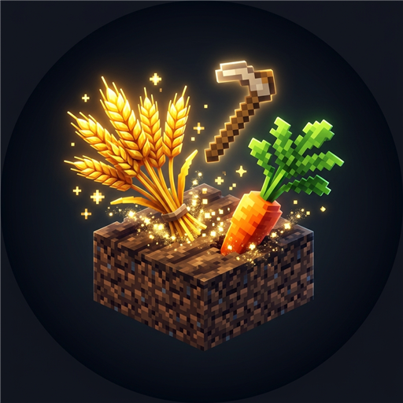

# Smart Harvest 🌾

**Smart Harvest** allows you to harvest and instantly replant mature crops with a simple right-click! No need to break and awkwardly replace crops ever again.

From the creator of [Quick Leaf Decay](https://modrinth.com/mod/quick-leaf-decay), [Bigger Ender Chest](https://modrinth.com/mod/bigger-ender-chest), [Bigger Shulker Boxes](https://modrinth.com/mod/bigger-shulker-boxes), [Fair Totem](https://modrinth.com/mod/fair-totem), and [Smart Double Doors](https://modrinth.com/mod/smart-double-doors).

---

## 📥 Downloadable Jars (All Versions)

Pre-compiled releases for every supported Minecraft version line:

| Minecraft Version | Download File | Supported Game Versions |
| :--- | :--- | :--- |
| **Minecraft 26.3** | [`smartharvest-26.3-1.0.0+mc26.3.jar`](https://github.com/antaripnandi/smart-harvest/releases/download/v1.0.0/smartharvest-26.3-1.0.0+mc26.3.jar) | `26.3` (Latest) |
| **Minecraft 26.2** | [`smartharvest-26.2-1.0.0+mc26.2.jar`](https://github.com/antaripnandi/smart-harvest/releases/download/v1.0.0/smartharvest-26.2-1.0.0+mc26.2.jar) | `26.2` |
| **Minecraft 26.1.x** | [`smartharvest-fabric-26.1-to-26.1.x.jar`](https://github.com/antaripnandi/smart-harvest/releases/download/v1.0.0/smartharvest-fabric-26.1-to-26.1.x.jar) | `26.1`, `26.1.1`, `26.1.2` |
| **Minecraft 1.21.x** | [`smartharvest-fabric-1.21.1-to-1.21.11.jar`](https://github.com/antaripnandi/smart-harvest/releases/download/v1.0.0/smartharvest-fabric-1.21.1-to-1.21.11.jar) | `1.21` - `1.21.11` |
| **Minecraft 1.20.5 - 1.20.6** | [`smartharvest-fabric-1.20.5-to-1.20.6.jar`](https://github.com/antaripnandi/smart-harvest/releases/download/v1.0.0/smartharvest-fabric-1.20.5-to-1.20.6.jar) | `1.20.5`, `1.20.6` |
| **Minecraft 1.20 - 1.20.4** | [`smartharvest-fabric-1.20.0-to-1.20.4.jar`](https://github.com/antaripnandi/smart-harvest/releases/download/v1.0.0/smartharvest-fabric-1.20.0-to-1.20.4.jar) | `1.20`, `1.20.1`, `1.20.2`, `1.20.3`, `1.20.4` |

All versions are also published and maintained on [Modrinth](https://modrinth.com/mod/smart-harvest).

---

## ✨ Features

- **Right-Click to Harvest**: Simply right-click any mature crop to harvest its produce and instantly replant it at age 0.
- **Full Crop Support**: Works with Wheat, Carrots, Potatoes, Beetroots, Nether Wart, Cocoa Beans, and Torchflowers!
- **Fortune & Tool Enchantments**: Fully respects Fortune enchantments on whatever tool or item you are holding.
- **Natural Drops & Seeds**: 1 seed is automatically deducted for replanting; all surplus crops, bonus seeds, and rare drops drop naturally.
- **Authentic Feedback**: Plays native crop harvest particles and sound effects with full sculk sensor game event integration.
- **Server Friendly**: Works 100% server-side. Vanilla clients can join servers running Smart Harvest without installing any mods!
- **Zero Conflicts**: Clean Fabric event implementation with zero invasive mixins.

---

## 🛠️ Installation

1. Install [Fabric Loader](https://fabricmc.net/use/installer/) for Minecraft Java Edition.
2. Download **Smart Harvest** `.jar` from the table above, [Modrinth](https://modrinth.com/mod/smart-harvest), or [GitHub Releases](https://github.com/antaripnandi/smart-harvest/releases).
3. Place the `.jar` file into your `.minecraft/mods` folder.
4. Launch the game and enjoy effortless farming!

---

## 📄 License

Available under the [MIT License](LICENSE).
